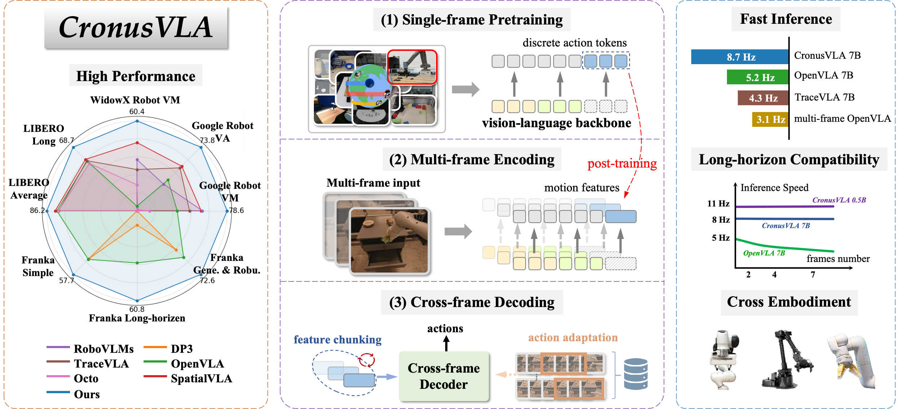

<br>
<p align="center">
  <h1 align="center"><strong>CronusVLA: Transferring Latent Motion Across Time for
Multi-Frame Prediction in Manipulation</strong></h1>
  <p align="center">
    <a href='' target='_blank'>Hao Li*</a>, <a href='' target='_blank'>Shuai Yang*</a>, <a href='https://yilunchen.com/about/' target='_blank'>Yilun Chen</a>, <a href='' target='_blank'>Yang Tian</a>, <a href='' target='_blank'>Xiaoda Yang</a>, <a href='' target='_blank'>Xinyi Chen</a>, <br><a href='https://hanqingwangai.github.io/' target='_blank'>Hanqing Wang</a>, <a href='https://tai-wang.github.io/' target='_blank'>Tai Wang</a>, <a href='https://scholar.google.co.uk/citations?user=r6CvuOUAAAAJ&hl=en' target='_blank'>Feng Zhao</a>, <a href='http://dahua.site/' target='_blank'>Dahua Lin</a>, <a href='https://oceanpang.github.io/' target='_blank'>Jiangmiao Pang</a>
    <br>
    * Equal Contributions
    <br>
    University of Science and Technology of China, Shanghai Artificial Intelligence Laboratory, <br> Zhejiang University, The Chinese University of Hong Kong
    <br>
  </p>

  <!-- <p align="center"><strong>Under Review</strong></p> -->
</p>

<div id="top" align="center">

[](https://arxiv.org/abs/2506.19816)
[](https://LiHaoHN.github.io/CronusVLA.github.io)

</div>


<!-- ## 📋 Contents

- [🔥 Highlight](#highlight)
- [🛠️ Getting Started](#getting_started)
- [📌 TODO](#todo)
- [🔗 Citation](#citation)
- [📄 License](#license)
- [👏 Acknowledgements](#acknowledgements) -->


## 🔥 Overview <a name="overview"></a>

**CronusVLA** is a unified framework that **extends single-frame VLA models to the multi-frame paradigm**. It including three key components: single-frame pretraining, multi-frame encoding and cross-frame decoding. An action adaptation mechanism is proposed to improve model finetuning performance.

**CronusVLA** achieves efficient inference, state-of-the-art performance on SimplerEnv, and considerable improvement over OpenVLA on LIBERO. Real-world Franka experiments also show the strong performance and robustness.





<!-- ## 🛠️ Getting Started <a name="getting_started"></a>

### Installation

First, clone this repository.

```
git clone https://github.com/OpenRobotLab/RoboSplat.git
```

(Optional) Use conda to manage the python environment.

```
conda create -n robosplat python=3.10 -y
conda activate robosplat
```

Install dependencies.
```
# Install PyTorch according to your CUDA version. For example, if your CUDA version is 11.8:
pip install torch==2.4.1 torchvision==0.19.1 torchaudio==2.4.1 --index-url https://download.pytorch.org/whl/cu118

# Install other dependencies
pip install -r requirements.txt

# Install diff-gaussian-rasterization (adapted from https://github.com/graphdeco-inria/diff-gaussian-rasterization)
pip install third_party/diff-gaussian-rasterization

# Install PyTorch3D. If you encounter any problems, please refer to the detailed installation instructions at https://github.com/facebookresearch/pytorch3d.
cd third_party
git clone https://github.com/facebookresearch/pytorch3d.git
cd pytorch3d
conda install -c bottler nvidiacub -y
curl -LO https://github.com/NVIDIA/cub/archive/1.16.0.tar.gz
tar xzf 1.16.0.tar.gz
export CUB_HOME=$PWD/cub-1.16.0
pip install -e .  # this may take a long time
cd ../..
``` -->


<!-- ### Download Data and Assets

We provide the reconstructed and preprocessed 3D Gaussians for demonstration generation. Please follow the steps below:

- Download `data.zip` from the [Google Drive folder](https://drive.google.com/drive/folders/1zUsHHKl21251-LdehpujsUFqt36vkqQX?usp=sharing).

- Place `data.zip` in the root directory of the repository. Then, unzip it by running `unzip data.zip`. -->


<!-- ### Usage

Generate novel demonstrations for the Pick task by running:

```
python data_aug/generate_demo.py \
    --image_size 256 \
    --save True \
    --save_video True \
    --ref_demo_path data/source_demo/real_000000.h5 \
    --xy_step_str '[10, 10]' \
    --augment_lighting False \
    --augment_appearance False \
    --augment_camera_pose False \
    --output_path data/generated_demo/pick_100
```

Description of Arguments:
- `--image_size`: (int) The size of the images in the generated demonstrations.
- `--save`: (bool) Whether to save the generated demonstrations.
- `--save_video`: (bool) Whether to save videos for visualizing the generated demonstrations.
- `--ref_demo_path`: (str) Path to the reference expert demonstration file.
- `--xy_step_str`: (str) A string in the form of '[`x`, `y`]', which specifies the density of object placement. Here, `x` is the number of object positions along the x-axis, and `y` is the number of positions along the y-axis. The total number of generated demonstrations will be `x` * `y`.
- `--augment_lighting`: (bool) Whether to apply lighting augmentation.
- `--augment_appearance`: (bool) Whether to apply appearance augmentation.
- `--augment_camera_pose`: (bool) Whether to apply camera pose augmentation.
- `--output_path`: (str) Path to save the generated demonstrations and the videos. -->


## 📌 TODO <a name="todo"></a>
### Code and checkpoints coming soon — stay tuned! 🚀
- [ ] Release the post-trained checkpoints and evaluation code of SimplerEnv (7B & 0.5B). 
- [ ] Release the finetuned checkpoints and evaluation code of LIBERO.
- [ ] Release the other checkpoints and training code for post-training and finetuning.
- [ ] More powerful CronusVLA v2.0.


## 🔗 Citation <a name="citation"></a>

<!-- If you find our work helpful, please cite: -->

```bibtex
@misc{2506.19816,
  Author = {Hao Li and Shuai Yang and Yilun Chen and Yang Tian and Xiaoda Yang and Xinyi Chen and Hanqing Wang and Tai Wang and Feng Zhao and Dahua Lin and Jiangmiao Pang},
  Title = {CronusVLA: Transferring Latent Motion Across Time for Multi-Frame Prediction in Manipulation},
  Year = {2025},
  Eprint = {arXiv:2506.19816},
  }
```
